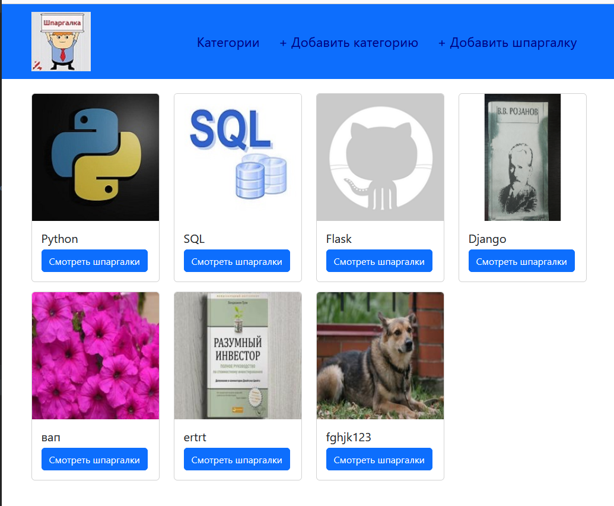
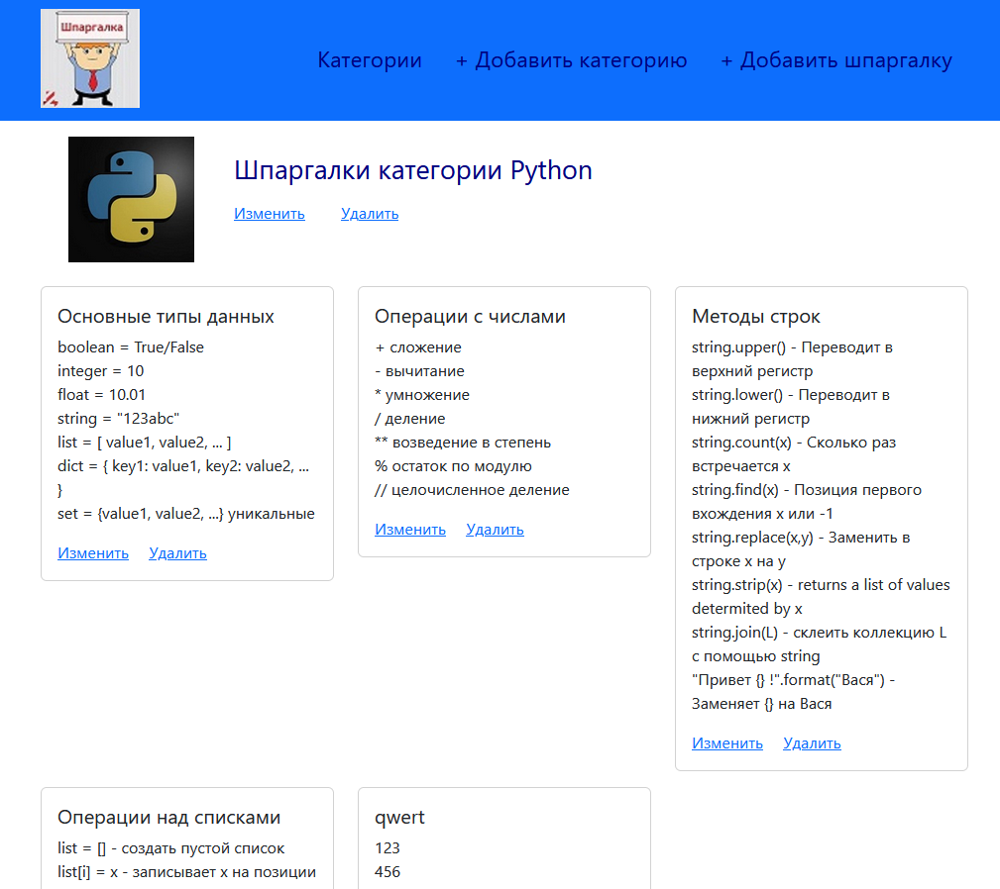
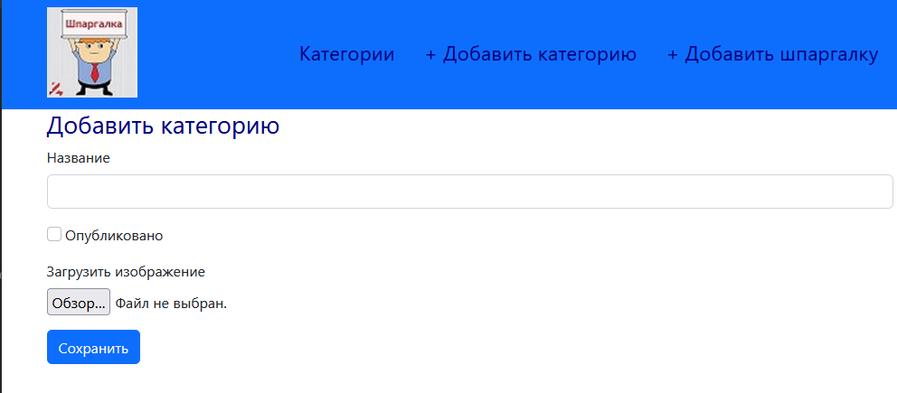
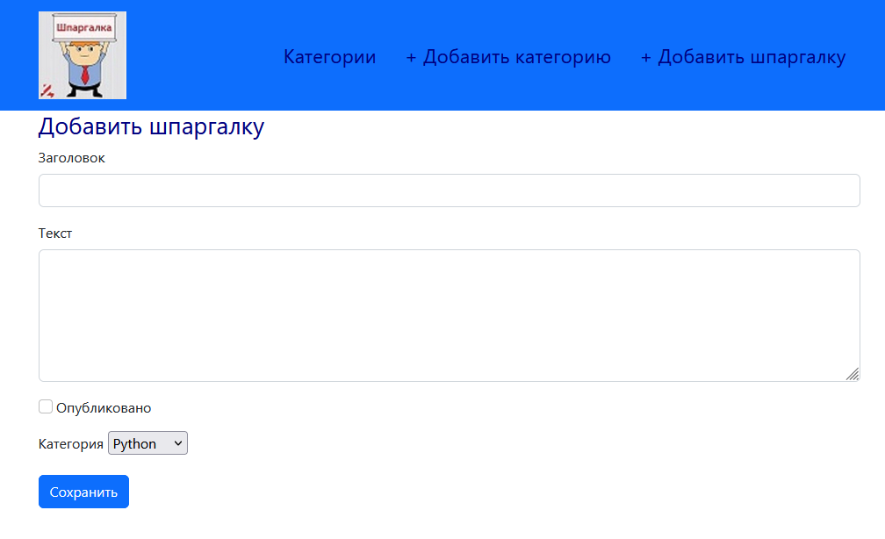

## Задание:

Написать приложение для шпаргалок.

На главной странице будут только категории. Которые по клику переносят нас на страницу с шпаргалками данной категории. 

К категориям можно добавить логотип.

Связь межу категориями и шпаргалками один ко многим. 

Реализовать добавление, удаление, редактирование категорий и шпаргалок.

При выполнении можно использовать sqlite.

## Реализация

Задачу реализовала с помощью фреймворка Flask, база данных - sqllite. Оформление с помощью bootstrap.

На главной странице список категорий с картинками. 

При клике на кнопку отображается страница со шпаргалками по выбранной категории

Добавление категории и шпаргалки через меню шапки, доступно на всех страницах, осуществляется через формы

Редактирование и удаление категории и шпаргалок на странице шпаргалок по категориям.